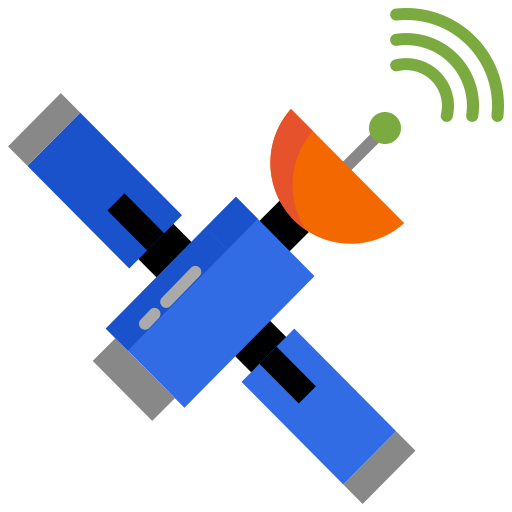
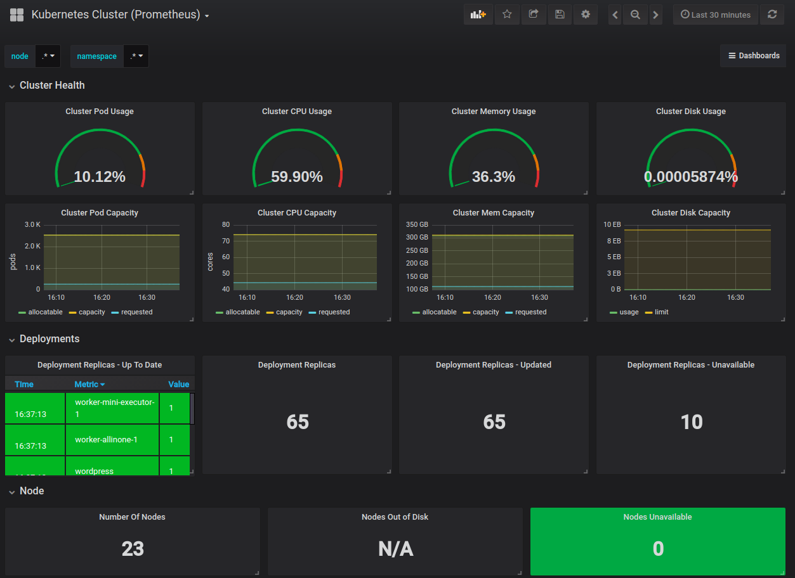

    

# 
KubeSat &middot;  

Deploy [Kubernetes](https://kubernetes.io/docs/concepts/overview/what-is-kubernetes/) on [AWS](https://docs.aws.amazon.com/) manually using [Terraform](https://www.terraform.io/docs/index.html) and [Ansible](https://docs.ansible.com/ansible/latest/index.html). Setup a monitoring solution using [Prometheus](https://prometheus.io/docs/prometheus/latest/getting_started/) and [Grafana](https://grafana.com/docs/) to gain oversight of the deployment.

## Introduction

Deploying Kubernetes the 'hard way' using Terraform and Ansible allows the developer to exercise more control over their cluster(s). It is also significantly cheaper than using a managed service such as [Amazon EKS](https://aws.amazon.com/eks/pricing/).

Terraform is a tool for building, changing, and versioning infrastructure safely and efficiently. Configuration files describe to Terraform the components needed to run an application. Terraform generates an execution plan to reach the desired state, and then executes it to build the described infrastructure.

Ansible is an IT automation tool. It can configure systems, deploy software, and orchestrate more advanced IT tasks such as continuous deployments or zero downtime rolling updates.

A monitoring solution comprised of Prometheus and Grafana provides the developer with more insight into their cluster's performance.

## System Diagram

    
    
System Diagram

## Demo

    
    
Grafana

## Setup

The setup documentation can be found in [`setup.md`](setup.md)

## Resources

Project icon[^](#kubesat) from [flaticon.com](https://www.flaticon.com/free-icon/retina_1632950?term=retina&page=1&position=4)

System diagram[^](#system-diagram) made with [draw.io](https://draw.io/)

### Contributors

-   [Adam Alston](https://github.com/adamalston)
-   [Kenneth Kron](https://github.com/biofool)
-   [Zachari Ramos](https://github.com/zramos2)
-   [Hari Ravichandran](https://github.com/hariravichandran)
-   [Anthony Galassi](https://github.com/bendhouseart)

[
Back to top
](#readme)